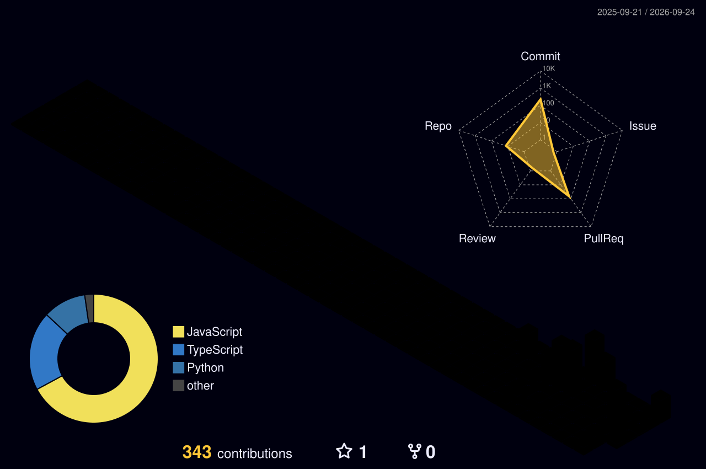

<!-- Header banner -->
<p align="center">
  
</p>

<!-- Animated tagline -->
<p align="center">
  <a href="https://github.com/VP171097">
    
  </a>
</p>

<p align="center">
  <a href="https://vp171097.github.io/Portfolio/"></a>
  <a href="https://www.linkedin.com/in/vp1710"></a>
  <a href="https://github.com/VP171097?tab=repositories"></a>
  
  
</p>

<p align="center">
  
</p>

---

## 👨‍💻 About me

```python
class VivekPandey:
    role      = "Data Engineer"
    company   = "Infosys Limited"
    location  = "Noida, India"
    portfolio = "https://vp171097.github.io/Portfolio/"

    focus     = ["Data pipelines", "Lakehouse architecture"]
    daily     = ["Python", "SQL", "PySpark", "Databricks", "Microsoft Azure"]

    def say_hi(self):
        return "Thanks for dropping by! Let's build something with data. 🚀"
```

---

## 🛠️ Tech stack

<p align="center">
  
  
  
  
  
  
  
  
  
</p>

<p align="center">
  
  
  
  
  
  
  
  
</p>

---

## 🚀 Featured projects

<table>
  <tr>
    <td width="50%" valign="top">
      <h3>🎙️ <a href="https://github.com/VP171097/contact-lens-voice-analytics-pipeline">contact-lens-voice-analytics-pipeline</a></h3>
      <p>Production-grade PySpark ETL for Amazon Connect voice transcripts, built on a Delta Lake Medallion architecture with CDF streaming and Databricks Workflows.</p>
      <p>  </p>
    </td>
    <td width="50%" valign="top">
      <h3>🏠 <a href="https://github.com/VP171097/TenantRentManager">TenantRentManager</a></h3>
      <p>App for managing tenants and tracking rent.</p>
      <p></p>
    </td>
  </tr>
</table>

<details>
<summary><b>📈 More data & analytics projects</b></summary>
<br/>

| Project | What it is |
|---|---|
| [Customer_segmentation](https://github.com/VP171097/Customer_segmentation) | Segments customers by demographics, interests and affluence for targeted marketing |
| [Bankruptcy-Prediction](https://github.com/VP171097/Bankruptcy-Prediction) | Classification model that predicts company bankruptcy |
| [Melbourne_Housing_Prices](https://github.com/VP171097/Melbourne_Housing_Prices) | Regression analysis of Melbourne housing prices |
| [ObjectDetection](https://github.com/VP171097/ObjectDetection) | Object detection with Python |

</details>

---

## 📊 GitHub stats

<p align="center">
  
</p>

<!-- Generated daily by .github/workflows/profile-3d.yml -->
<p align="center">
  
</p>

<!-- Generated daily by .github/workflows/snake.yml -->
<p align="center">
  <picture>
    <source media="(prefers-color-scheme: dark)" srcset="https://raw.githubusercontent.com/VP171097/VP171097/output/github-snake-dark.svg" />
    <source media="(prefers-color-scheme: light)" srcset="https://raw.githubusercontent.com/VP171097/VP171097/output/github-snake.svg" />
    
  </picture>
</p>

---

## 📫 Let's connect

<p align="center">
  <a href="https://vp171097.github.io/Portfolio/"></a>
  <a href="https://www.linkedin.com/in/vp1710"></a>
</p>

<p align="center"><i>I may be slow to respond, but I'll always get back to you. ✨</i></p>

<!-- Footer wave -->
<p align="center">
  
</p>
